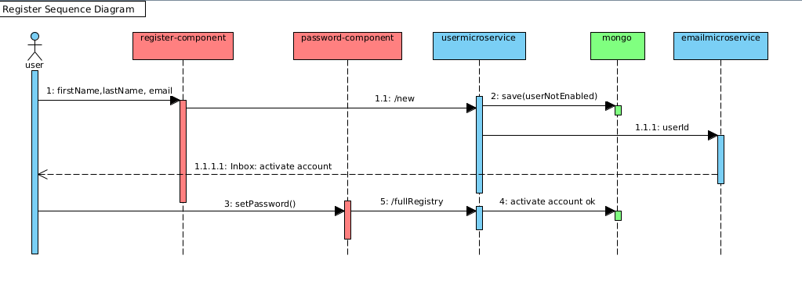
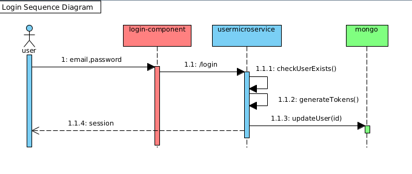
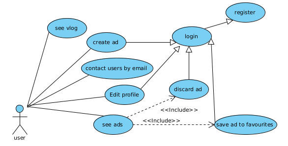
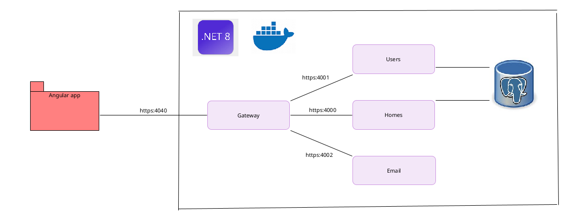
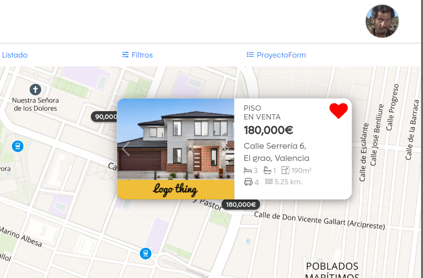
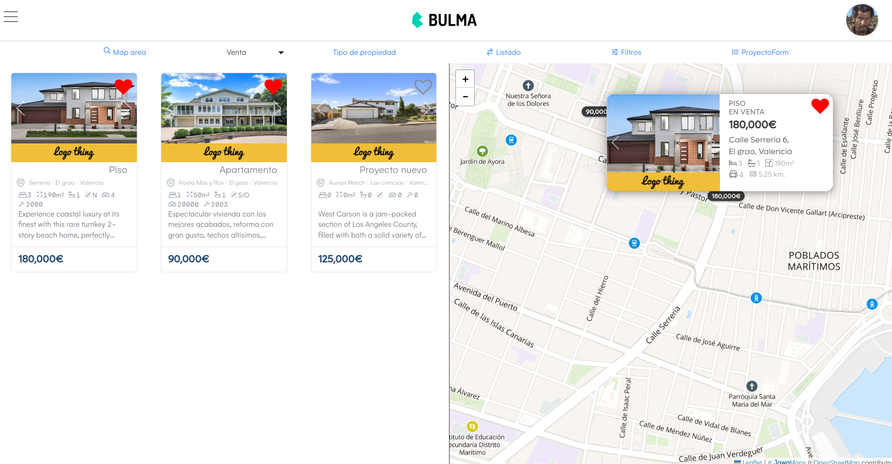
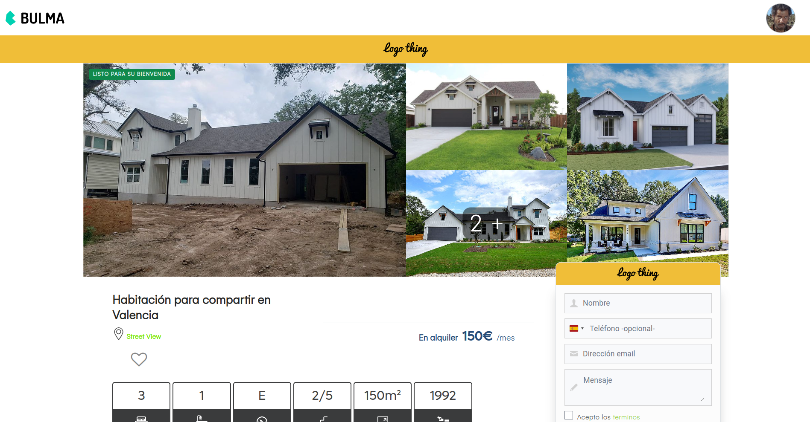
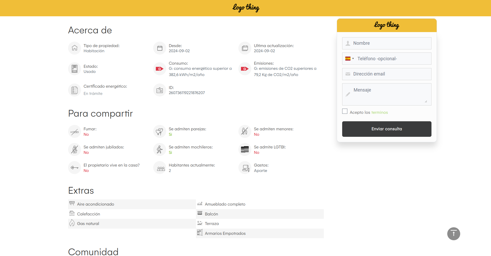

# MyHouse - Demo

A property finder demo project using leaflet maps. 

## Setup

npm i

ng s -o

## Backend

Run backend-7 project from another repo.

## Getting Started

First you need to have geolocation enabled and create an account. When the map will be fixed on your current location click at 'Publicar' and a new marker will appear on the screen. This marker can be caught and draged. After drag when you drop the marker a new buttons appears to confirm your location choice, if you're on the right location click at 'Hecho' and complete all form. Then u can see the ad with his price and some detail in a marker.

https://github.com/user-attachments/assets/a2e3bfe7-a90a-4b0e-a722-788d483502e5

https://github.com/user-attachments/assets/0db20275-d1f6-4623-9b51-b1519eaea79e

https://github.com/user-attachments/assets/bf051937-ab15-47cd-ae7b-7ff0e7716aea

https://github.com/user-attachments/assets/3e64d808-c699-4669-a97e-8e95c9b1ec51

https://github.com/user-attachments/assets/258b6967-6cd1-406c-b3d8-aa15128d8011

https://github.com/user-attachments/assets/4fa1437d-9df0-479e-93e0-2f5f6ed3ab86

https://github.com/user-attachments/assets/52a39f83-7ac0-4ce7-9a19-cd511a0c97d2

https://github.com/user-attachments/assets/999ff6c5-3492-4074-affa-1783c0f1fcf9

https://github.com/user-attachments/assets/23b5da2e-07ea-4365-97d8-b24fd1b01a97

https://github.com/user-attachments/assets/ac143501-7ee3-44f5-bab2-d2dae7a10b52

https://github.com/user-attachments/assets/c87afe4f-9406-4b48-9f90-687d18504a46

Pro-users may custom their ads with logo and color

