# MyHouse - Demo

A property finder demo project using leaflet maps. 

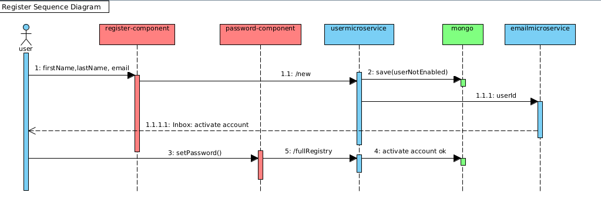

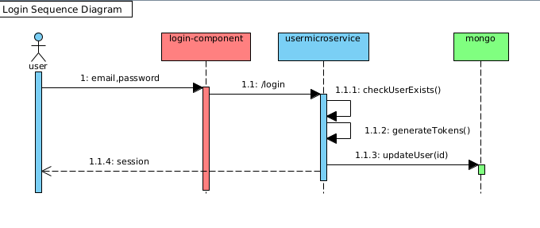

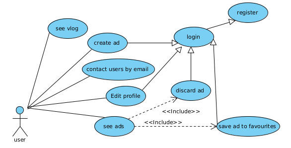

## Setup

npm i

ng s -o

## Backend

Run backend-7 project from another repo.

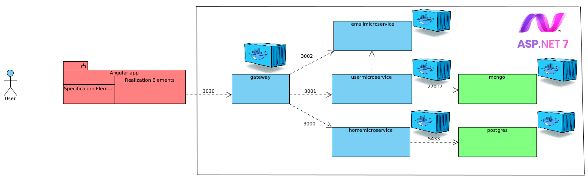

## Getting Started

First you need to have geolocation enabled and create an account. When the map will be fixed on your current location click at 'Publicar' and a new marker will appear on the screen. This marker can be caught and draged.

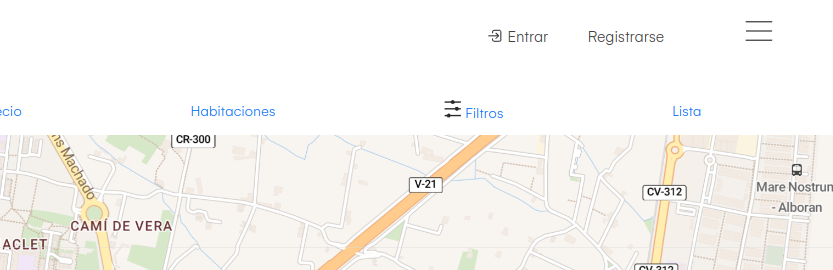

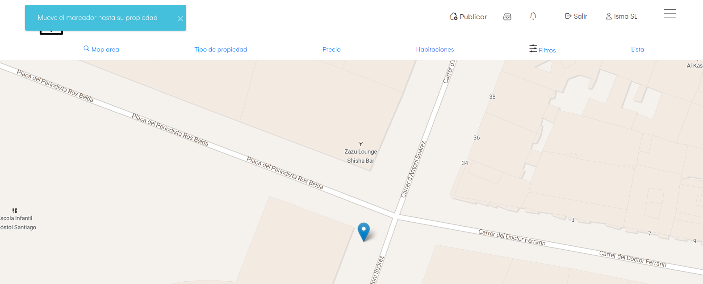

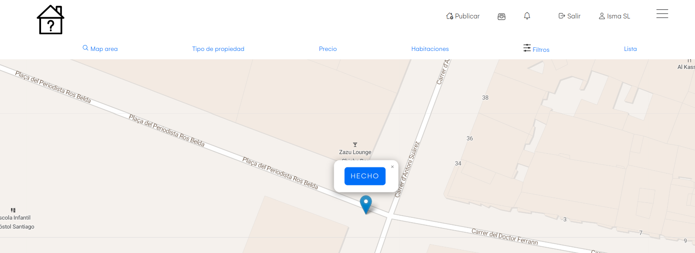

After drag when you drop the marker a new buttons appears to confirm your location choice, if you're on the right location click at 'Hecho' and complete all form. Then u can see the ad with his price in a marker.

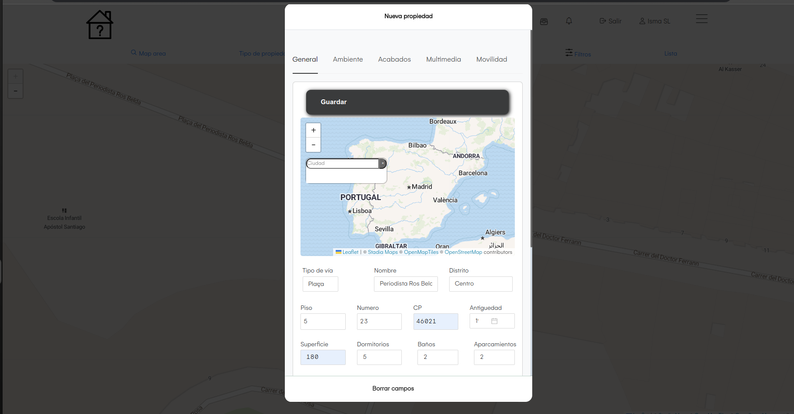
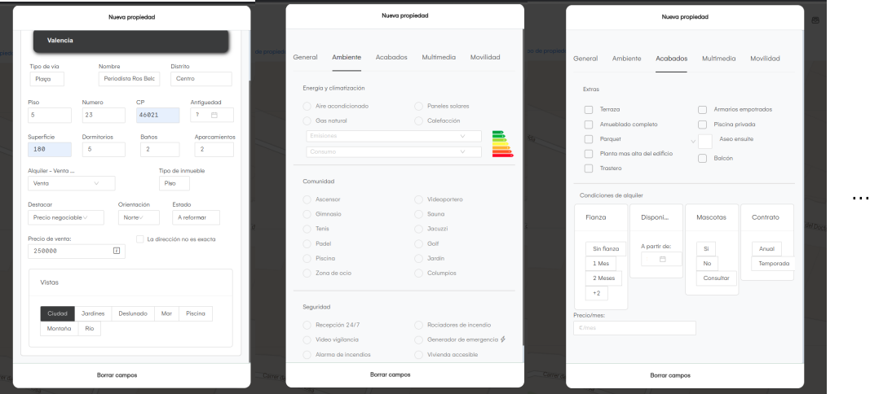
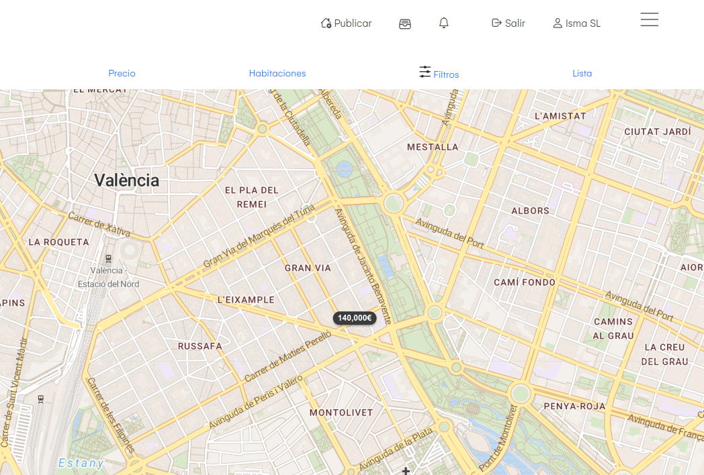
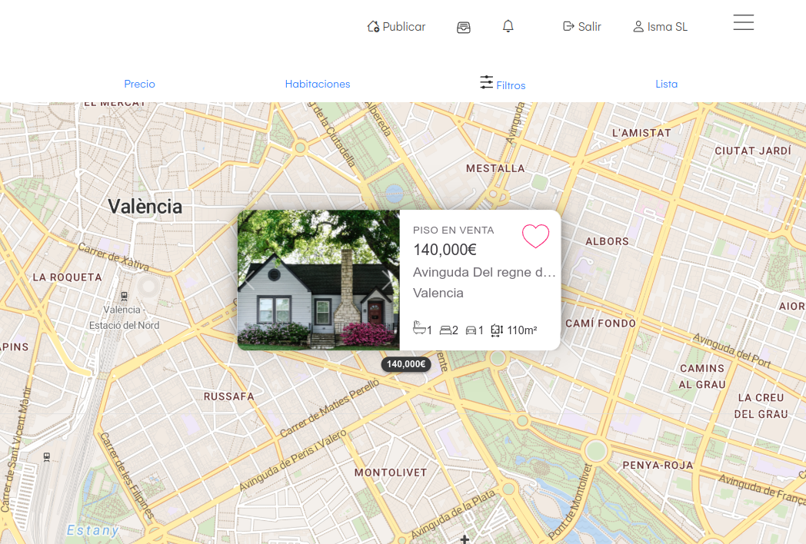
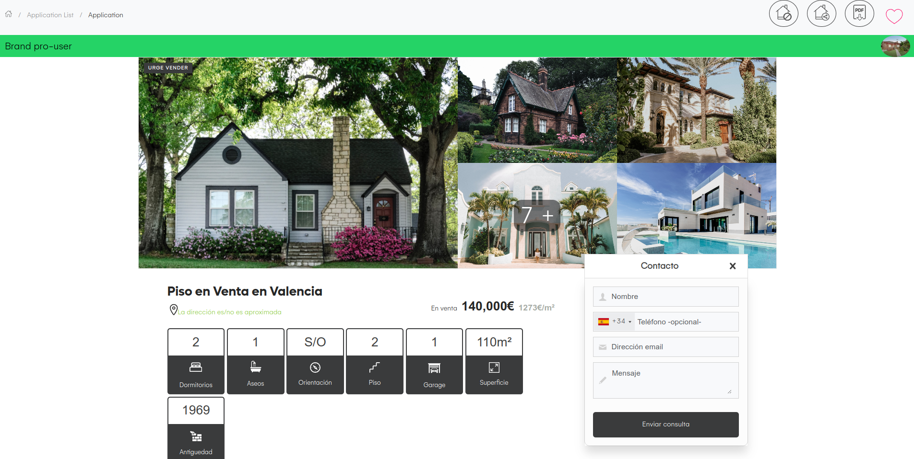
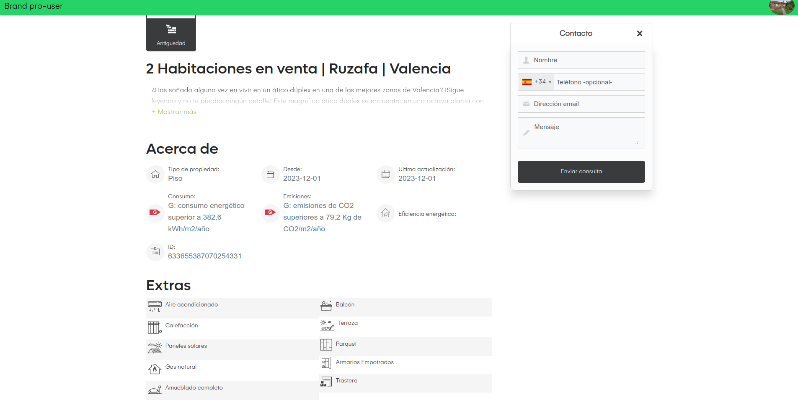
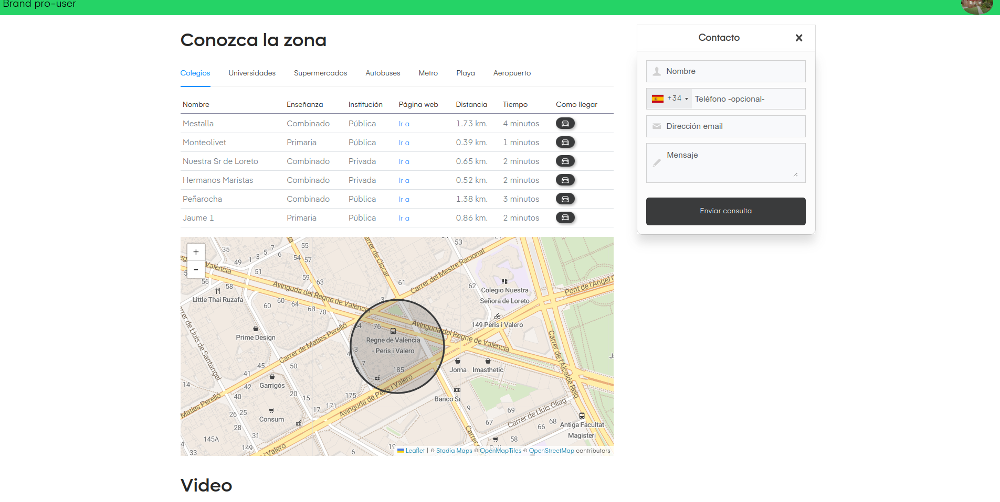

